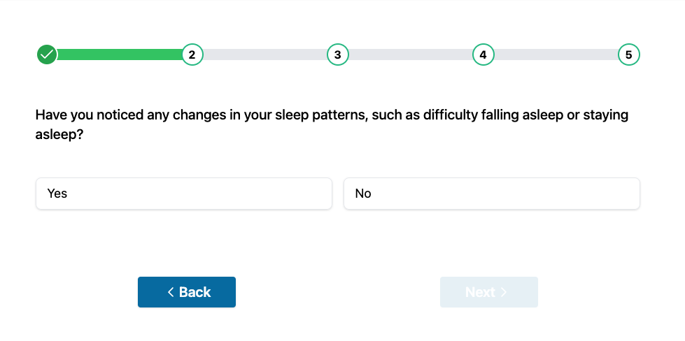

# MedExpress

This project is developed using React and TypeScript, built upon create-vite as the foundational framework.

node version: v20.3.1

## Installation

To install the necessary Node modules, use the following command:

```bash
npm install
```

## Getting Started

To run the project locally, execute the following command:

```bash
npm run dev
```

## CSS Styling

The primary styling framework used in this project is Tailwind CSS.

## Routing

The project employs react-router-dom for page navigation. There are three main pages in the project:

- **Home:** `/`
- **Questionnaire:** `/Questionnaire`
- **Thank You:** `/ThankYou`

```jsx
<Routes>
  <Route path="/" element={<Home />} />
  <Route path="/Questionnaire" element={<Questionnaire />} />
  <Route path="/ThankYou" element={<ThankYou />} />
</Routes>
```

Sure, here's an improved version of the "Data Management" and "Questionnaire Components" sections in the README:

## Data Management (Questions)

In this project, we assume that the data is received via a fetch request, and it is formatted as follows:

```javascript
[
  {
    id: 1,
    questionNumber: 1,
    question:
      "Have you experienced any persistent pain or discomfort in the last week that you would like the doctor to assess?",
  },
  // ... other questions
];
```

### Handling the Data:

The project uses `useEffect` to create a new array, adding an additional parameter "response," and saving it in a state.

```javascript
useEffect(() => {
  if (answers.length === 0) {
    const res: AnsweredQuestionType[] = questions.map((item) => {
      return { ...item, response: "" };
    });
    setAnswers(res);
  }
}, [questions]);
```

## Questionnaire Components



The questionnaire components consist of three key sections:

1. **Linear Progress View**

2. **Question and Answer Inputs:**

   This section displays the actual question and provides input fields for answers.

3. **Navigation Buttons:**

   Use the navigation buttons to easily move between questions.
   Certainly! Here's an improved version of the README section for the provided code:

## Handling User Responses

### Handling User Click on a Response

```jsx
const handleClick = (ans: "yes" | "no") => {
  setAnswers((prev) =>
    prev.map((item) => (item.id === question.id ? { ...item, response: ans } : item))
  );
};
```

This function updates the state to record the user's response to a specific question. The response is set as either "yes" or "no" based on user input.

### Submitting User Responses

Upon submitting the final question, the user's responses are sent to an API function. Additionally, Zustand, a state management tool, is employed to save the answers for potential use in other components.

```jsx
const handleSubmit = () => {
  let hasUserAnsweredAll = answers.every((item) => item.response !== "");
  // Check if the user has answered all questions before submission
  if (hasUserAnsweredAll) {
    // Send user responses to the API function
    ApiService.sendDataToApi(answers);
    // Store the answers in a Zustand state for potential later use
    setAnsweredQuestion(answers);
    // Navigate to the "Thank You" page
    navigate("/thankyou");
  }
};
```

This function checks if the user has provided responses to all questions before submission. If so, it sends the responses to the API using the `ApiService` function. Additionally, the user's answers are stored using Zustand for potential future use in other components.
# questions
